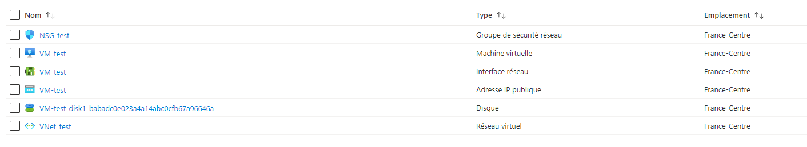

# Projet Powershell

Ce projet est constitué de deux scripts :

1/ Déploiements de VMs Azure

2/ Installation d'un AD + DNS et création d'utilisateurs

## 1/ Déploiements de machines virtuelles sur Azure

### A - Pré-requis

Pour pouvoir exécuter le script, il faut installer le module Azure.

```powershell
Install-Module Azure -AllowClobber
Import-Module Azure
```

Ensuite, il faut se connecter à son compte Azure sur lequel nous souhaitons faire nos manipulations.

```powershell
Connect-AzAccount
```

### B - Fonction VM_creation

La créationd de fonction permet de faciliter la création de VM et d'éviter de réécrire de nombreuses choses.
```powershell
function VM_creation {
    param ([string]$vm_name,[string]$RG_name,[string]$Location_name, `
    [string]$VNet_name,[string]$subnet_name, [string]$NSG_name)
    
    New-AzVm -ResourceGroupName $RG_name -Location $Location_name -Name $vm_name `
    -SecurityGroupName $NSG_name -VirtualNetworkName $VNet_name -SubnetName $subnet_name

    #Pas de possibilité de setup le "Standard_B1s" de base, donc on l'update à la création de la VM
    Stop-AzVM -ResourceGroupName $RG_name -Name $vm_name -Force
    $vm = Get-AzVM -ResourceGroupName $RG_name -VMName $vm_name
    $vm.HardwareProfile.VmSize = "Standard_B1s"
    Update-AzVM -VM $vm -ResourceGroupName $RG_name
    Start-AzVM -ResourceGroupName $RG_name  -Name $vm.name
}
```
Dans cette fonction, nous avons mis en paramètres les informations dont nous avons besoin, afin de pouvoir vraiment simplifier la démarche.

Enfin, nous ne pouvons (contrairement au CLI Azure) fournir de base la "VM Size" que l'on souhaite. Ainsi, le script va en fournir une par défaut. C'est pourquoi nous faisons une update de la machine afin de passer dans la "VM Size" voulue.

### C - Appel de la fonction

Le fait d'avoir mis des paramètres dans la fonction va permettre d'avoir un appel de la fonction plus personnalisé et de pouvoir mettre nos propres paramètres au sein de l'appel. Ainsi, les différents paramètres que l'on rempli sont ceux de notre fonction.

```powershell
VM_creation -vm_name (Read "Nom de la VM  ") `
            -RG_name (Read "Nom du RG  ") `
            -Location_name (Read "Nom de la location  ") `
            -VNet_name (Read "Nom du VNet  ") `
            -subnet_name (Read "Nom du subnet  ") `
            -NSG_name (Read "Nom du NSG  ") 
```

NB : Nous avons créé un alias au début du script de "Read-Host" vers "Read" qui nous permet donc faciliter l'écriture et la lecture de ce dernier.

## Principales sources
[Documentation Microsoft : "Azure Windows - Quick create Powershell"](https://docs.microsoft.com/en-us/azure/virtual-machines/windows/quick-create-powershell) 

[Documentation Microsoft : "Azure Virtual Network - Quick create Powershell"](https://docs.microsoft.com/en-us/azure/virtual-network/quick-create-powershell)

[Documentation Microsoft : "Azure - Network Security Group"](https://docs.microsoft.com/en-us/powershell/module/az.network/new-aznetworksecuritygroup?view=azps-6.1.0)

[Documentation Microsoft : "Azure Virtual Network - B Series"](https://docs.microsoft.com/fr-fr/azure/virtual-machines/sizes-b-series-burstables)


